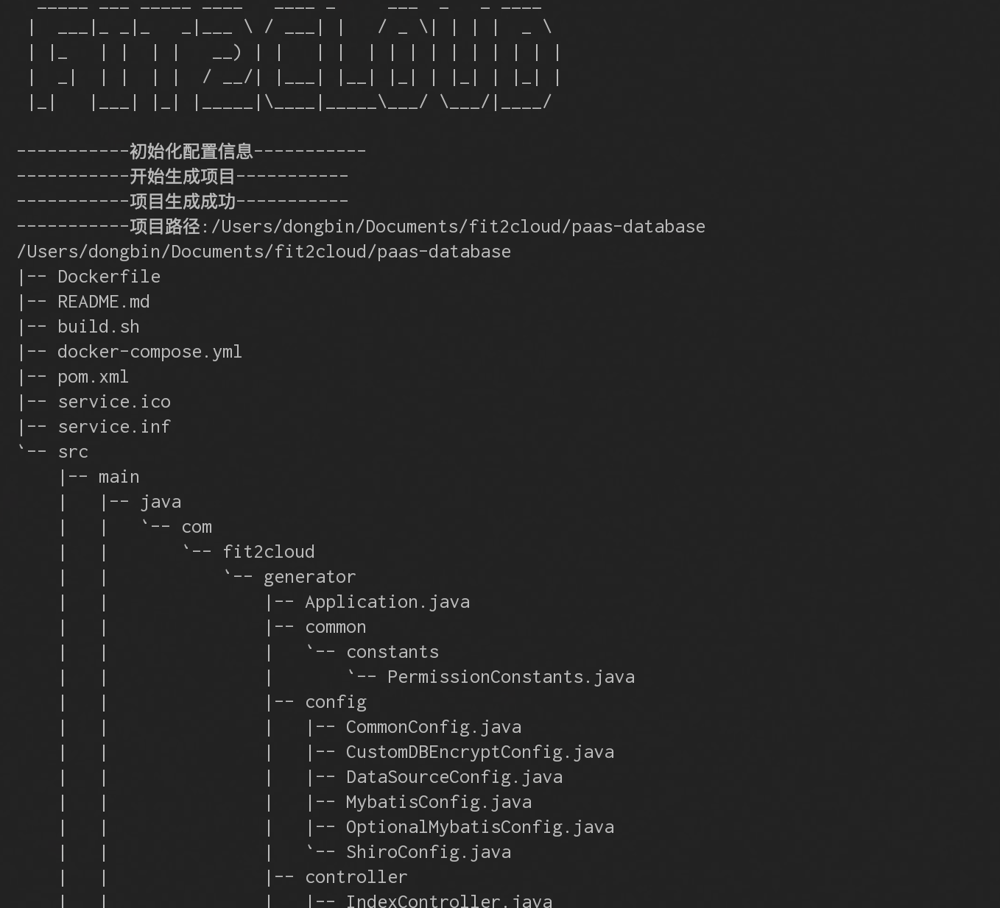

# FIT2CLOUD 2.0 扩展模块代码生成

- 使用
```bash
git clone https://github.com/dongbintop/fit2cloud2.0-generator.git
运行 `fit2cloud2.0-generator` 的 main 方法

```

- 参数配置
```bash
resource下的 config.properties

# 模块名称(小写)，默认fit2cloud2.0-demo
module.name=paas-database
# 模块概览，默认${module.name}
module.summary=FIT2CLOUD 数据开放平台
# 模块顺序，默认20
module.order=20
# 模块端口，默认8080
module.port=8080
# 项目生成路径，默认 user.home
projectPath=/Users/dongbin/Documents/fit2cloud
# 项目包名称，默认com.fit2cloud. 加上 ${module.name}最后一个单词
package=com.fit2cloud.generator 
# 默认 com.fit2cloud
groupId=com.fit2cloud
# 默认 2.0.0
version=2.0.0
```

- 生成截图




  
 


